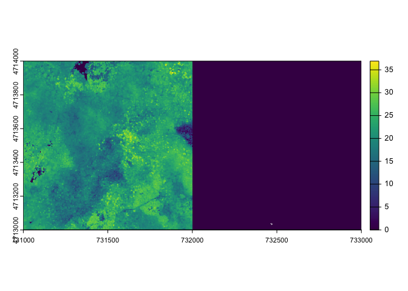

# README


## Tree detection and segmentation at Harvard Forest

The following includes downloading and preprocessing steps as well as
the tree detection and segmentation.

## Setup

Install packages

``` r
install.packages(c("pak", "neonOS", "neonUtilities", "here"))
pak::pak("samherniman/easytrees")
```

Setup parallel processing and the output directory

``` r
future::plan(future::multisession, workers = 8L)
lidR::set_lidr_threads(4)
lasR::set_parallel_strategy(lasR::nested(2, 4L))
```

``` r
output_dir <- here::here("data/derivative")
```

This downloads two tiles of the Harvard Forest NEON ALS

``` r
neonUtilities::byTileAOP(
  dpID = "DP1.30003.001",
  site = "HARV",
  year = "2022",
  easting = 732183,
  northing = 4713265,
  buffer = 200,
  savepath = here::here("data/raw/las/harv")
)
```

Read in the ALS point clouds

``` r
ctg <- lidR::readLAScatalog(here::here("data/raw/las/harv"), recursive = TRUE)
# plot(ctg, mapview = TRUE)
ctg
```

    class       : LAScatalog (v1.3 format 3)
    extent      : 731000, 733000, 4713000, 4714000 (xmin, xmax, ymin, ymax)
    coord. ref. : WGS 84 / UTM zone 18N 
    area        : 2 km²
    points      : 39.4 million points
    density     : 19.7 points/m²
    density     : 7.3 pulses/m²
    num. files  : 2 

Excecute the preprocessing pipeline. This pipeline classifies ground
points and normalizes the point clouds, it then creates a DTM (which is
not used), and pitfilled CHM.

``` r
pipeline <- 
  easytrees::setup_pipeline(output_dir) |> 
  easytrees::create_pipeline()

ans = lasR::exec(pipeline, on = ctg)
```

## Tree detection

Read in the normalized point clouds, CHM, and create a function for tree
detection

``` r
ctg <- lidR::readLAScatalog(
  fs::path(output_dir, "normalized")
)

chm <- terra::rast(fs::path(output_dir, "chm", "chm.tif"))

f <- function(x) {
  y <- 2.6 * (-(exp(-0.08*(x-2)) - 1)) + 3
  y[x < 2] <- 3
  y[x > 20] <- 5
  return(y)
}
lidR::opt_chunk_size(ctg) <- 5000
```

``` r
ctg
```

    class       : LAScatalog (v1.3 format 3)
    extent      : 731000, 733000, 4713000, 4714000 (xmin, xmax, ymin, ymax)
    coord. ref. : WGS 84 / UTM zone 18N 
    area        : 2 km²
    points      : 39.4 million points
    density     : 19.7 points/m²
    density     : 7.3 pulses/m²
    num. files  : 1 

Carry out tree detection

``` r
ttops <- lidR::locate_trees(ctg, lidR::lmf(f), uniqueness = "bitmerge")
```

``` r
ttops$treeID <- 1:nrow(ttops)
sf::st_write(ttops, fs::path(output_dir, "treetops", "treetops.fgb"), append = FALSE)
```

``` r
ttops
```

    Simple feature collection with 43139 features and 2 fields
    Geometry type: POINT
    Dimension:     XY
    Bounding box:  xmin: 731000 ymin: 4713000 xmax: 733000 ymax: 4714000
    Projected CRS: WGS 84 / UTM zone 18N
    First 10 features:
       treeID     Z                 geometry
    1       1 17.90 POINT (731478.3 4713500)
    2       2 15.49 POINT (731497.2 4713498)
    3       3 15.93   POINT (731462 4713498)
    4       4 20.49 POINT (731421.2 4713499)
    5       5 18.72 POINT (731487.8 4713496)
    6       6 17.41 POINT (731473.7 4713496)
    7       7 17.73 POINT (731492.8 4713495)
    8       8 20.23   POINT (731401 4713498)
    9       9 20.44 POINT (731435.2 4713496)
    10     10 18.04 POINT (731454.7 4713496)

Create the segmentation algorithm and run it

``` r
algo3 <- lidR::watershed(chm, th_tree = 2, tol = 1, ext = 1)
lidR::opt_laz_compression(ctg) <- TRUE
lidR::opt_output_files(ctg) <- paste0(output_dir, "/clouds/water_{XCENTER}_{YCENTER}_d")
ctg <- lidR::segment_trees(ctg, algo3, attribute = "IDwater")
```

``` r
ctg
```

    class       : LAScatalog (v1.3 format 3)
    extent      : 731000, 733000, 4713000, 4714000 (xmin, xmax, ymin, ymax)
    coord. ref. : WGS 84 / UTM zone 18N 
    area        : 2 km²
    points      : 39.4 million points
    density     : 19.7 points/m²
    density     : 7.3 pulses/m²
    num. files  : 1 

## Create convex hulls around each segmented tree

Needs some cleaning up

``` r
ctg <- lidR::readLAScatalog(
  fs::path(output_dir, "clouds")
)
lidR::opt_chunk_size(ctg) <- 50000
```

``` r
library(lidR)
# las <- lidR::readLAS(ctg[1,])
cm_las <- lidR::crown_metrics(ctg, func = .stdtreemetrics, attribute = "IDwater", geom = "concave") |> 
  dplyr::filter(convhull_area < 400) |> 
  sf::st_make_valid()
```

``` r
# removed all trees that are greater than 400 square meters in area
# because those ones usually have really weird hulls
```

``` r
sf::st_write(cm_las, fs::path(output_dir, "hulls.fgb"), append = FALSE)
```

## Visualize

``` r
baba_ras <- here::here("data/derivative/baba/baba.tif") |> 
# baba_ras <- here::here("data/derivative/chm/chm.tif") |> 

  terra::rast()
```

``` r
library(terra)
plot(baba_ras$z_p95)
```



``` r
plot(baba_ras$z_above10)
```


``` r
baba_ras$understory <- 100 - baba_ras$z_above3
plot(baba_ras$understory)
```


